# Cross-Domain Lung Segmentation with Attention U-Net and SAM

> **Computer Vision Course Project — Mohammad Foad Adib**
>
> A reproducible research pipeline for studying **lung segmentation under domain shift** in chest X-ray images, comparing a task-specific **Attention U-Net** with **SAM ViT-B** adapted through **encoder freezing** and a **custom LoRA** path, with an explicit prompt-generation and ablation framework.


---

## 1. Project at a glance

This repository implements a complete experiment pipeline for evaluating how segmentation models behave when the **training image domain and evaluation image domain differ**.

The pipeline is organized around three ideas:

1. **Task-specific baseline:** an Attention U-Net trained from scratch on Shenzhen chest X-rays.
2. **Foundation-model adaptation:** SAM ViT-B adapted for the same segmentation task using either a frozen vision encoder or custom LoRA adapters.
3. **Prompt sensitivity:** U-Net predictions are converted into bounding-box prompts for SAM, with single-box, prompt-ensemble, oracle-box, and stress-test conditions.

The default protocol treats **Shenzhen as the in-domain source** and keeps **Montgomery fully held out as the cross-domain test set**. The implementation also contains explicit leakage guards, reproducibility controls, checkpointing, memory monitoring, and statistical utilities for the ablation analysis.

### Core pipeline

```mermaid
flowchart LR
    A[Chest X-ray datasets\nShenzhen + Montgomery] --> B[Validation & pairing]
    B --> C[Domain-aware split\nShenzhen: train/val/test\nMontgomery: cross-domain test]
    C --> D[Attention U-Net]
    D --> E[Predicted lung mask]
    E --> F[Bounding-box extraction\n+ fallback handling]
    F --> G[SAM ViT-B]
    G --> H1[Freeze encoder]
    G --> H2[LoRA adaptation]
    H1 --> I[Single box / Ensemble / Oracle / Stress]
    H2 --> I
    I --> J[Dice / IoU / HD95]
    J --> K[Cross-domain degradation Δ]
    K --> L[Reports + plots + JSON/CSV]
```



---

## 2. Research objective

The repository is designed to answer five practical questions:

- How does a task-specific Attention U-Net compare with SAM ViT-B after task adaptation?
- Does LoRA provide a meaningful gain over the frozen-encoder strategy under constrained GPU memory?
- How much performance is lost when moving from the training domain to an unseen domain?
- Does using multiple prompt-box variants improve SAM segmentation robustness?
- Can the training and inference pipeline operate within a constrained GPU-memory budget?

The project is intentionally structured as an **ablation study**, rather than a single-model benchmark.

---

## 3. Datasets

The code is configured for the Kaggle distribution:

**Chest X-Ray Masks and Labels**  
`nikhilpandey360/chest-xray-masks-and-labels`

The implementation identifies the two image sources from filename prefixes:

| Domain | Prefix | Role in the default protocol |
|---|---|---|
| Shenzhen | `CHNCXR_` | In-domain train / validation / test |
| Montgomery | `MCUCXR_` | Fully held-out cross-domain test |

The accompanying project report describes the dataset as **662 Shenzhen images** and **138 Montgomery images**. The executable split logic, rather than these report totals, is the authority for what is actually used in a run.

### Mask handling

The validator is designed around the different mask naming conventions found in the dataset:

- Shenzhen masks may contain a `_mask` suffix.
- Montgomery may provide multiple lung-side masks.
- Multiple paired masks are unioned into a single binary lung mask.
- Generated combined masks are excluded from subsequent input scans to avoid accidental duplication.

This logic lives in `data/validator.py` and is followed by a data-leakage guard in `data/split.py` and `data/dataset.py`.

---

## 4. Experimental protocol

### Domain split

The default configuration in `configs/base.yaml` uses:

- Shenzhen: **70% train / 15% validation / 15% in-domain test**
- Montgomery: **100% cross-domain test**
- Seed: **42**

Five-fold cross-validation is performed on the **Shenzhen train+validation pool** for U-Net robustness assessment. The final U-Net used to generate SAM prompts is then trained on the full Shenzhen train+validation subset, while the Shenzhen test set remains untouched for the final evaluation.

### Image resolutions

| Component | Resolution |
|---|---:|
| Native pipeline | 512 × 512 |
| U-Net input | 256 × 256 |
| SAM processing frame | SAM processor frame (default ViT-B path uses 1024-pixel longest edge) |

Normalization statistics are computed from the **in-domain training data only** and reused at inference time.

---

## 5. Models

### Attention U-Net

Implemented in `models/unet.py`.

The current code defines:

- Grayscale input (`1` channel)
- Binary output (`1` channel)
- Four encoder levels
- Feature widths `[32, 64, 128, 256]`
- Attention gates on skip connections
- Batch normalization + ReLU convolution blocks
- Transposed-convolution upsampling
- Combined Dice + BCE loss

For the current default architecture, the instantiated network contains **7,851,197 trainable parameters**.

### SAM ViT-B: frozen-encoder adaptation

Implemented with Hugging Face `transformers` in `models/sam_wrapper.py`.

Default strategy:

- Model: `facebook/sam-vit-base`
- Vision encoder: frozen
- Prompt encoder: trainable
- Mask decoder: trainable
- Single-mask output for deterministic training/evaluation
- Image embeddings can be cached because the frozen encoder does not change
- Box perturbation is enabled during training

### SAM ViT-B: custom LoRA adaptation

Implemented in `models/lora_sam.py`.

The repository does **not** use the external PEFT package for this path. Instead, it wraps the fused QKV projection with a custom low-rank adapter because SAM's attention structure is handled explicitly.

Default LoRA configuration:

| Parameter | Value |
|---|---:|
| Rank | 8 |
| Alpha | 16 |
| Dropout | 0.05 |
| Target | fused `qkv` projections in the vision encoder |
| Gradient checkpointing | enabled |
| Image-embedding cache | disabled |

This is a parameter-efficient adaptation path, but the implementation is intentionally kept inside the repository so the exact trainable components are transparent.

---

## 6. Automatic prompt generation

A central part of the project is the bridge between the task-specific U-Net and SAM.

```text
Chest X-ray
   ↓
Attention U-Net inference
   ↓
Predicted binary lung mask
   ↓
Connected-component / foreground analysis
   ↓
Bounding-box extraction
   ↓
Outer-box margin + coordinate clamping
   ↓
SAM box prompt
```

Implemented in `prompt_generation/box_extractor.py`.

The pipeline also stores whether a fallback box was required. The fallback is explicitly logged rather than silently replacing an invalid prediction.

### Prompt variants

`prompt_generation/perturbation.py` provides deterministic inference-time prompt variants and seeded training-time perturbations.

The ensemble uses three box variants:

1. Base box
2. Expanded box
3. Shifted box

Their binary SAM outputs are combined through majority voting.

Two additional prompt conditions support controlled analysis:

- **Oracle box:** derived from the ground-truth mask and used only for the A7 analysis.
- **Stress box:** deliberately corrupted box used for A8 sensitivity analysis.

The oracle path is isolated from the live prompt-generation path to reduce the risk of accidental ground-truth prompt leakage.

---

## 7. Ablation design

The evaluation code defines eight experimental conditions:

| ID | Configuration | Purpose |
|---|---|---|
| **A1** | U-Net baseline | Task-specific baseline |
| **A2** | SAM zero-shot | Unadapted SAM reference |
| **A3** | SAM Freeze + single box | Frozen-encoder adaptation with one prompt |
| **A4** | SAM Freeze + ensemble | Effect of prompt diversity |
| **A5** | SAM LoRA + single box | LoRA with one prompt |
| **A6** | SAM LoRA + ensemble | LoRA + prompt ensemble |
| **A7** | SAM Freeze + oracle box | Prompt-quality upper-bound analysis |
| **A8** | SAM Freeze + stress box | Prompt degradation / sensitivity analysis |

The project therefore separates the effects of **model family**, **adaptation strategy**, and **prompt quality** instead of collapsing them into one comparison.

---

## 8. Evaluation metrics

The repository computes metrics **per image first** and aggregates them afterward.

### Dice

Measures overlap between the predicted mask `P` and the ground-truth mask `G`:

\[
Dice = \frac{2|P \cap G|}{|P| + |G|}
\]

Higher is better.

### IoU

\[
IoU = \frac{|P \cap G|}{|P \cup G|}
\]

Higher is better.

### HD95

The implementation computes the symmetric 95th-percentile Hausdorff distance from **surface pixels**, using `scipy.spatial.cKDTree`.

Lower is better.

### Cross-domain degradation

The repository defines:

\[
\Delta Dice = Dice_{in-domain} - Dice_{cross-domain}
\]

A smaller absolute degradation indicates a smaller domain-shift gap.

For the research-question analysis, the code also includes bootstrap confidence intervals and significance testing utilities, with an explicit note that a single training seed does **not** establish training-run variance.

---

## 9. Reported results

The repository includes a completed project report containing the following reported ablation values. These numbers are reproduced here for convenient reference; they are **report artifacts**, not values freshly re-generated during this README review.

| ID | Configuration | Dice (In) | IoU (In) | HD95 (In) | Dice (XD) | IoU (XD) | HD95 (XD) | Δ Dice |
|---|---|---:|---:|---:|---:|---:|---:|---:|
| A1 | U-Net | 0.9531 | 0.9123 | 8.2 | 0.8712 | 0.7714 | 22.5 | 0.0819 |
| A2 | SAM zero-shot | 0.0823 | 0.0431 | 245.0 | 0.0641 | 0.0342 | 260.1 | 0.0182 |
| A3 | SAM Freeze + single box | 0.8987 | 0.8154 | 18.7 | 0.8023 | 0.6701 | 32.4 | 0.0964 |
| A4 | SAM Freeze + ensemble | 0.9142 | 0.8421 | 14.3 | 0.8256 | 0.7043 | 26.1 | 0.0886 |
| A5 | SAM LoRA + single box | 0.9065 | 0.8263 | 16.5 | 0.8154 | 0.6842 | 28.9 | 0.0911 |
| A6 | SAM LoRA + ensemble | 0.9218 | 0.8512 | 13.1 | 0.8398 | 0.7221 | 24.2 | 0.0820 |
| A7 | SAM Freeze + oracle box | 0.9376 | 0.8841 | 10.5 | 0.8601 | 0.7562 | 20.8 | 0.0775 |
| A8 | SAM Freeze + stress box | 0.7834 | 0.6452 | 35.2 | 0.6847 | 0.5214 | 42.7 | 0.0987 |

The accompanying report also documents approximate memory figures of **~7.2 GB for SAM Freeze** and **~9.1 GB for SAM LoRA during training** on its reported setup.

---

## 10. Repository structure

```text
.
├── configs/
│   ├── base.yaml
│   ├── unet.yaml
│   ├── sam_freeze.yaml
│   └── sam_lora.yaml
│
├── data/
│   ├── cleaner.py
│   ├── dataset.py
│   ├── downloader.py
│   ├── split.py
│   ├── transforms.py
│   └── validator.py
│
├── models/
│   ├── unet.py
│   ├── sam_wrapper.py
│   └── lora_sam.py
│
├── prompt_generation/
│   ├── box_extractor.py
│   ├── ensemble.py
│   └── perturbation.py
│
├── training/
│   ├── losses.py
│   ├── unet_trainer.py
│   └── sam_trainer.py
│
├── evaluation/
│   ├── metrics.py
│   ├── evaluator.py
│   └── cross_domain_eval.py
│
├── visualization/
│   └── plots.py
│
├── reports/
│   └── report_generator.py
│
├── utils/
│   ├── checkpoint.py
│   ├── logging_utils.py
│   ├── memory_monitor.py
│   └── reproducibility.py
│
├── tests/
│   ├── unit/
│   ├── integration/
│   └── pipeline/
│
├── notebooks/
│   └── colab_execution_guide.py
│
├── run_experiment.py
├── requirements.txt
├── setup.py
└── README.md
```

### Supporting artifacts included in the project bundle

- `final_cross_domain_lung_segmentation.docx` — written project report
- `final_report.pdf` — PDF version of the report
- `ارائه_نهایی_Cross-Domain-Lung-Segmentation.pptx [Repaired] [Autosaved].pptm` — presentation artifact

---

## 11. Installation

### Recommended environment

The project is written for **Python 3.10+** and is designed around GPU execution for SAM training.

```bash
python -m venv .venv

# Linux / macOS
source .venv/bin/activate

# Windows
# .venv\\Scripts\\activate

python -m pip install --upgrade pip
pip install -r requirements.txt
```

### Important dependency note

The current source imports `scikit-learn` from `data/split.py`, but the checked-in `requirements.txt` does not list it. For a fresh environment, install it explicitly:

```bash
pip install scikit-learn
```

Then install the repository as a local package if desired:

```bash
pip install -e .
```

> `requirements.txt` and `setup.py` are therefore not perfectly synchronized. This README follows the executable source rather than assuming the packaging metadata is complete.

---

## 12. Dataset access

The pipeline downloads the dataset through the Kaggle API.

Set either:

```bash
export KAGGLE_USERNAME="your_username"
export KAGGLE_KEY="your_api_key"
```

or place your credentials at:

```text
~/.kaggle/kaggle.json
```

The downloader supports both approaches and validates the dataset before training.

The configured dataset identifier is:

```text
nikhilpandey360/chest-xray-masks-and-labels
```

The dataset itself is **not bundled** in this repository.

---

## 13. Running the full experiment

The main orchestrator is `run_experiment.py`.

### Complete run

```bash
python run_experiment.py --config configs/base.yaml --start_stage 0
```

The stages are:

```text
Stage 0  Download + validate dataset
Stage 1  Clean + split + compute normalization/fallback statistics
Stage 2  Train U-Net (5-fold CV + final model)
Stage 3  Generate U-Net-derived SAM prompt boxes + oracle boxes
Stage 4  Train SAM with frozen vision encoder
Stage 5  Train SAM with custom LoRA (optional)
Stage 6  Evaluate A1-A8 and compute cross-domain statistics
Stage 7  Generate visualizations
Stage 8  Generate the final Markdown report
```

### Skip LoRA

Because LoRA is the memory-heaviest path, it can be skipped:

```bash
python run_experiment.py --config configs/base.yaml --start_stage 0 --skip_lora
```

### Resume from an existing stage

The runner stores `.done` markers under the checkpoint directory.

For example:

```bash
python run_experiment.py --config configs/base.yaml --start_stage 4
```

Starting from a later stage assumes the artifacts required by the skipped stages already exist.

---

## 14. Generated artifacts

A successful run populates directories such as:

```text
checkpoints/
├── unet_cv/
├── unet_final/
├── sam_freeze/
└── sam_lora/

data/
├── processed/
└── splits/

logs/
reports/
└── output/

visualizations/
```

Key machine-readable outputs include:

```text
reports/output/
├── ablation_results_raw.json
├── ablation_comparison.csv
├── rq_answers.json
├── statistics.json
├── summary_metrics.json
└── final_report.md
```

Other useful intermediate artifacts include:

```text
data/processed/dataset.csv
data/processed/norm_stats.json
data/processed/fallback_box_stats.json
data/processed/prompt_boxes.csv
data/processed/oracle_boxes.csv
data/splits/splits.csv
data/splits/split_meta.json
```

---

## 15. Colab workflow

A dedicated execution guide is available at:

```text
notebooks/colab_execution_guide.py
```

It documents a sequential Google Colab workflow, including:

- Drive persistence
- Kaggle credential setup
- Dataset download and validation
- U-Net training
- Prompt generation
- SAM Freeze training
- optional LoRA training
- ablation evaluation
- report generation
- resume instructions after a Colab disconnect

The project configuration explicitly targets constrained GPU environments; the LoRA route is treated as secondary because of its higher memory cost.

---

## 16. Reproducibility and safety checks in the code

Several implementation details are explicitly designed to reduce silent experimental errors:

- Global seed setup in `utils/reproducibility.py`
- Deterministic train-loader generators
- Runtime leakage assertions for Montgomery samples
- Domain-aware split metadata
- Train-only normalization statistics
- Explicit separation of pipeline boxes and oracle boxes
- Box coordinate clamping
- Resolution-aware empty-mask HD95 penalties
- Boundary-based HD95 calculation
- Checkpoint rotation and resume support
- GPU memory tracking with a 14 GB safety threshold
- Graceful handling of a failed LoRA stage
- Per-image metrics before aggregation
- Bootstrap confidence intervals and multiple-comparison correction utilities for the research-question analysis

These safeguards are part of the implementation itself; they are not inferred from the project report alone.

---

## 17. Testing status

The repository contains unit, integration, and pipeline tests covering data handling, prompt generation, losses, metrics, memory behavior, and several previously identified regression cases.

### Static source validation

The current source tree passes Python bytecode compilation:

```text
python -m compileall -q .
→ OK
```

### Current automated-test caveat

A full `pytest` collection in the review environment does **not** currently reach the test execution stage because `tests/integration/test_data_pipeline.py` imports the old helper name `_assert_no_montgomery_in_training`, while the current implementation exposes `_assert_no_nonindomain_in_training`.

Therefore this repository should **not** claim "all tests passing" until that API mismatch is repaired and the suite is rerun in a matching environment.

---

## 18. Important version/report consistency note

The bundled written report contains some parameter and environment tables that do not exactly match the current executable source/configuration.

Examples observed during repository review:

- The current U-Net implementation instantiates **7,851,197** trainable parameters, whereas an older report table describes it as approximately **3.4M**.
- The current `configs/unet.yaml` uses batch size **8** and learning rate **1e-4**; older report tables list different values.
- The current SAM implementation uses **Hugging Face Transformers + custom LoRA**, while older report text mentions the separate `segment-anything` / PEFT packages.
- The current `sam_freeze.yaml` uses **50** training epochs and batch size **4**, while an older report table lists different values.

For reproducibility, **the executable Python source and YAML configuration should be treated as the authoritative specification of the current repository state**.

---

## 19. Limitations

This repository is an experimental / educational research project and should not be interpreted as a clinical validation study.

Important limitations include:

- The default study uses a single training seed for SAM experiments.
- Bootstrap confidence intervals quantify uncertainty over scored images, not variance over multiple independent training runs.
- Cross-domain evaluation depends on the availability and successful pairing of both configured domains.
- Reported performance values are tied to the particular data split, preprocessing, implementation, and hardware/software environment.
- The LoRA path may exceed the practical memory budget on lower-memory GPUs.

---

## 20. Project references

The implementation and accompanying report discuss the following core ideas:

- **Attention U-Net** — attention gates for medical image segmentation.
- **Segment Anything Model (SAM)** — promptable general-purpose segmentation foundation model.
- **LoRA** — low-rank adaptation for parameter-efficient fine-tuning.
- **PP-SAM-style prompt perturbation** — training with imperfect box prompts for prompt robustness.
- **SAM-U-style prompt ensembles** — multiple box variants combined for more stable predictions.

The exact paper references used by the course report are included in the bundled written report.

---

## 21. Author

**Mohammad Foad Adib**  
Computer Engineering / Computer Vision Course Project

---

## 22. License

No open-source license file is currently included in the repository. Unless a license is added, reuse and redistribution should be treated as **all rights reserved**.

---

## Quick reference

```bash
# 1. Install
python -m pip install --upgrade pip
pip install -r requirements.txt
pip install scikit-learn
pip install -e .

# 2. Configure Kaggle credentials
#    KAGGLE_USERNAME / KAGGLE_KEY

# 3. Run the pipeline
python run_experiment.py --config configs/base.yaml --start_stage 0

# 4. Or skip the secondary LoRA path
python run_experiment.py --config configs/base.yaml --start_stage 0 --skip_lora
```

> **Reproducibility principle:** use the current Python source and YAML configuration as the executable specification, and treat the bundled report/presentation as supporting documentation of the study.
